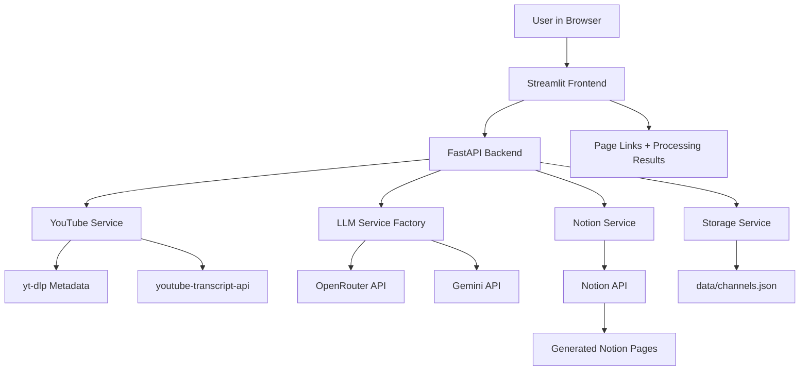

# YouTube to Notion Guide Generator

Turn YouTube videos into organized Notion study notes, implementation guides, and action-ready reference pages.

This app works like a research assistant that watches YouTube for you. Paste a single video link or a YouTube channel link, choose the videos you care about, pick an AI engine such as OpenRouter or Gemini, and the app turns the transcript into a clean Notion guide with summaries, terms, tools, steps, code snippets, resources, and timestamped highlights.

## What It Does

You give the app YouTube videos. It gives you structured Notion pages.

The workflow is simple:

1. Open the app.
2. Paste a YouTube channel link, channel handle, video link, or video ID.
3. Fetch the latest videos from the channel, or inspect the single video directly.
4. Select the videos you want notes for.
5. Choose the AI provider and model that should write the guide.
6. Let the app read the transcript.
7. Let the AI transform that transcript into a clean application guide.
8. Save the guide into your Notion database.
9. Open the generated Notion page links.

OpenRouter and Gemini are two interchangeable AI engines. OpenRouter gives you access to many hosted models behind one API, while Gemini uses Google's Gemini models directly. The app lets you choose which one should synthesize each run.

## Generated Notion Pages

Each processed video becomes a Notion page designed for learning, execution, and later reference.

The page can include:

- Main idea of the video
- Important technical terms
- Tools, apps, platforms, and services mentioned
- Quick actions you can apply in a few minutes
- Step-by-step implementation instructions
- Code snippets when the video includes or implies code
- Useful links and resources
- Important timestamps
- Source video metadata and processing status

The goal is not just to summarize a video. The goal is to turn passive watching into something you can search, apply, revisit, and build from.

## Best Use Cases

- Convert tutorial videos into reusable implementation notes
- Build a Notion knowledge base from favorite creators
- Process a channel's latest uploads without watching everything first
- Capture tools, links, and code ideas from long technical videos
- Create study guides from courses, demos, talks, and walkthroughs
- Compare different AI models for the same transcript synthesis task

## Features

- Accepts YouTube channel URLs, handles, video URLs, and video IDs
- Discovers latest channel uploads before processing
- Lets you choose exactly which videos to convert
- Processes single videos directly
- Extracts transcripts automatically
- Supports OpenRouter and Gemini
- Allows provider and model selection from the Streamlit sidebar
- Creates structured Notion guide pages
- Can create or verify the Notion database
- Tracks saved channels locally in `data/channels.json`
- Provides API endpoints for automation and testing
- Includes Render-friendly startup scripts for deployment

## System Architecture



## Tech Stack

| Layer | Technology |
| --- | --- |
| Frontend | Streamlit |
| Backend | FastAPI |
| Data models | Pydantic |
| YouTube metadata | yt-dlp |
| Transcripts | youtube-transcript-api |
| AI synthesis | OpenRouter or Gemini |
| Notes database | Notion API |
| Local storage | JSON file storage |
| Deployment support | Render startup scripts |

## Project Structure

```text
YtVideoGuides/
|-- backend/
|   |-- main.py                    # FastAPI app and API routes
|   |-- config.py                  # Environment-based settings
|   |-- models.py                  # Request, response, and guide schemas
|   |-- services/
|   |   |-- youtube_service.py      # Channel, video, and transcript handling
|   |   |-- openrouter_service.py   # OpenRouter guide generation
|   |   |-- gemini_service.py       # Gemini guide generation
|   |   |-- notion_service.py       # Notion database and page creation
|   |   |-- storage_service.py      # Local channel history
|   |   `-- __init__.py            # LLM provider factory
|   `-- utils/
|       |-- logger.py
|       `-- transcript_chunker.py
|-- frontend/
|   |-- app.py                     # Streamlit interface
|   |-- api_client.py              # Backend client
|   |-- components/                # Input, progress, and result components
|   `-- assets/                    # Architecture and UI images
|-- data/
|   `-- channels.json              # Saved channel metadata
|-- docs/                          # Deployment and operations docs
|-- functions/                     # Optional serverless entry points
|-- build.sh                       # Render build script
|-- requirements.txt
`-- README.md
```

## Requirements

- Python 3.10 or newer
- A Notion integration token
- At least one AI provider key:
  - OpenRouter API key
  - Gemini API key
- A Notion page or workspace where the integration can create/access a database

## Environment Variables

Create a `.env` file in the project root.

```bash
# Required for Notion output
NOTION_API_KEY=secret_your_notion_integration_token

# Optional: use an existing Notion database
NOTION_DATABASE_ID=your_existing_database_id

# Choose the default AI provider
LLM_PROVIDER=openrouter

# OpenRouter
OPENROUTER_API_KEY=sk-or-v1_your_openrouter_key
OPENROUTER_MODEL=openai/gpt-4o-mini
OPENROUTER_BASE_URL=https://openrouter.ai/api/v1
OPENROUTER_SITE_URL=http://localhost
OPENROUTER_APP_NAME=YouTube-to-Notion Guide Generator

# Gemini
GEMINI_API_KEY=your_gemini_key
GEMINI_MODEL=gemini-2.5-flash

# Processing limits
MAX_VIDEOS_PER_CHANNEL=5
MAX_CONCURRENT_VIDEOS=3
MAX_TOKENS_PER_CHUNK=30000
RESPONSE_MAX_TOKENS=4096
REQUEST_TIMEOUT=60

# Local services
BACKEND_HOST=0.0.0.0
BACKEND_PORT=8000
STREAMLIT_PORT=8501
LOG_LEVEL=INFO
```

You can configure both OpenRouter and Gemini at the same time. The sidebar lets you choose the provider and model for a run, while `LLM_PROVIDER` controls the default backend provider.

## Notion Setup

1. Go to https://www.notion.so/my-integrations.
2. Create a new internal integration.
3. Copy the integration token into `NOTION_API_KEY`.
4. Open the Notion page where your database should live.
5. Use the page menu to add a connection to your integration.
6. In the app sidebar, click `Setup/Verify Database`, or provide `NOTION_DATABASE_ID` if you already have a database.

If no database ID is supplied, the backend attempts to create or reuse the configured guide database through the Notion service.

## Install

```bash
pip install -r requirements.txt
```

## Run Locally

Start the backend:

```bash
uvicorn backend.main:app --reload --host 127.0.0.1 --port 8000
```

Start the frontend in a second terminal:

```bash
streamlit run frontend/app.py
```

Open:

```text
http://localhost:8501
```

## How To Use The App

1. Open the Streamlit app.
2. Confirm the sidebar says the backend is connected.
3. Choose an AI provider: `OpenRouter` or `Gemini`.
4. Choose a model, or enter a custom model ID supported by that provider.
5. Add a Notion database ID, or let the app create/verify one.
6. Paste a YouTube channel or video input.
7. Click `Fetch Latest Videos` to preview and select videos.
8. Click `Process Selected Videos`.
9. Review the processing summary.
10. Open the generated Notion page links.

For quick runs, use `Process Latest Now` to process the latest videos without manually selecting them.

## API Reference

| Method | Endpoint | Purpose |
| --- | --- | --- |
| `GET` | `/health` | Check backend, Notion, and AI provider configuration |
| `POST` | `/api/v1/discover-videos` | Discover latest channel videos or inspect one video |
| `POST` | `/api/v1/process-videos` | Process selected videos or a direct video input |
| `POST` | `/api/v1/process-channel` | Backward-compatible channel processing endpoint |
| `GET` | `/api/v1/channels` | List saved channels |
| `POST` | `/api/v1/notion/setup` | Create or verify a Notion database |
| `POST` | `/api/v1/test-youtube` | Test YouTube source discovery |
| `POST` | `/api/v1/test-llm` | Test the configured AI provider |
| `POST` | `/api/v1/test-openrouter` | Test OpenRouter directly |
| `POST` | `/api/v1/test-gemini` | Test Gemini directly |

### Example: Discover Videos

```bash
curl -X POST http://127.0.0.1:8000/api/v1/discover-videos \
  -H "Content-Type: application/json" \
  -d "{\"source_input\":\"https://www.youtube.com/@fireship\",\"max_videos\":5}"
```

### Example: Process Selected Videos

```bash
curl -X POST http://127.0.0.1:8000/api/v1/process-videos \
  -H "Content-Type: application/json" \
  -d "{\"source_input\":\"https://www.youtube.com/@fireship\",\"selected_video_ids\":[\"VIDEO_ID\"],\"llm_provider\":\"gemini\",\"llm_model\":\"gemini-2.5-flash\",\"max_videos\":5}"
```

## Response Shape

Processing returns a channel/source summary plus one result per video.

```json
{
  "channel_id": "UC...",
  "channel_name": "Example Channel",
  "source_type": "channel",
  "results": [
    {
      "video_id": "abc123",
      "video_title": "Build Something Useful",
      "status": "success",
      "notion_page_url": "https://www.notion.so/...",
      "prompt_tokens": 12000,
      "completion_tokens": 1800,
      "total_tokens": 13800
    }
  ],
  "summary": {
    "total": 1,
    "successful": 1,
    "failed": 0,
    "skipped": 0
  }
}
```

## AI Output Schema

The backend asks the selected AI provider to produce an `ApplicationGuide` with:

- `big_idea`
- `key_terms`
- `tools_and_apps`
- `apply_5min`
- `implementation_steps`
- `code_snippets`
- `resources`
- `key_timestamps`

This schema keeps the Notion output consistent even when you switch between OpenRouter and Gemini.

## Troubleshooting

### Backend Not Connected

- Make sure FastAPI is running on port `8000`.
- Check `BACKEND_URL` if the frontend is deployed separately.
- Open `http://127.0.0.1:8000/health` and confirm the backend responds.

### AI Provider Shows Not Configured

- Check that the matching API key exists in `.env`.
- Confirm `LLM_PROVIDER` is either `openrouter` or `gemini`.
- If using a custom model, confirm the provider supports that model ID.

### No Transcript Available

- Some videos do not expose captions or transcripts.
- Try a different video from the same channel.
- Check whether the video has captions available on YouTube.

### Notion API Error

- Confirm `NOTION_API_KEY` is correct.
- Share the target Notion page/database with your integration.
- If using `NOTION_DATABASE_ID`, verify the integration can access that database.

### Processing Is Slow

- Long videos produce large transcripts.
- Large transcripts may be chunked before synthesis.
- Use fewer videos per run or choose a faster/cheaper model.


For deployed frontends, set:

```bash
BACKEND_URL=https://your-backend-service.platform.com
```

For deployed backends, configure the same provider and Notion environment variables used locally.


## Development Notes

- Keep AI provider behavior behind `create_llm_service`.
- Keep generated guide fields aligned with `ApplicationGuide` in `backend/models.py`.
- Prefer adding provider-specific details inside the provider service, not the API route.
- Treat the Streamlit app as the user workflow layer and FastAPI as the automation/API layer.

## License

MIT
